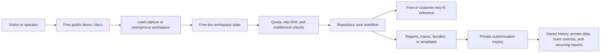

# Revenue Architecture - dream-interpretation-pages

This document turns the repository architecture into a zero-to-low-cost service path. It is not a revenue guarantee; it defines the product boundary, free-tier launch stack, metering hooks, and upgrade path needed to test willingness to pay before taking on fixed infrastructure cost.

## Productized Offer

| Layer | Decision |
| --- | --- |
| Target buyer / user | consumer wellness user or content operator needing a lightweight reflective AI experience |
| Productized offer | AI-assisted dream reflection with browser-local reading history and edited symbol guides |
| First paid SKU | fixed-scope private product customization for one audience-specific dream reflection workflow |
| Free lead magnet | free dream reflection tool, symbol guide, and browser-local reading history |
| Paid expansion | audience-specific flow, branded content set, privacy and claim boundary, deployment package, and handoff notes |
| Data / workflow moat | personal symbol history, anonymized theme clusters, report templates, and retention-friendly journal exports |
| Private inquiry | https://kim3310-doeon-kim-portfolio.pages.dev/?offer=dream-interpretation-pages&inquiry=consumer-prototype-customization#private-inquiry |

## Free-Tier-First Launch Stack

| Concern | Default choice |
| --- | --- |
| Build and coding loop | OpenCode, Kimi Code CLI, Freebuff, Lovable, Ollama-assisted local agents |
| Public front door | Cloudflare Pages first, with Vercel/Netlify as alternate static front doors |
| Backend / state | Cloudflare Workers for thin APIs, Supabase/Firebase for managed auth and data, Render/Oracle/GCP free VM only when a long-running process is unavoidable |
| AI inference | OpenRouter, Groq, Cerebras, Cloudflare Workers AI, NVIDIA NIM, Ollama local fallback |
| Storage / exports | Supabase Storage, Firebase Storage, Cloudflare R2/KV/D1 depending on data shape |
| Repo-specific launch path | Cloudflare Pages + Workers, KV/D1 for anonymous quota and sessions, R2 for exports, OpenRouter/Groq/Kimi/Qwen-style free models with strict wellness disclaimers |

Keep exact provider quotas out of the product contract. Free-tier limits change; the architecture should degrade gracefully through caching, daily quotas, customer-supplied API keys, and an explicit paid workspace switch.

## System Shape

## Metering And Paywall Hooks

- Start with anonymous read-only demos and synthetic data so traffic costs stay near zero.
- Add `workspace_id`, `plan`, `quota_day`, and `export_count` fields before any paid workflow; this lets the app enforce limits without redesign.
- Cache AI outputs by normalized prompt, scenario, model, and version. Paid users can bypass cache with their own provider key.
- Keep audience-specific flows, private connectors, longer retention, branded content sets, team controls, and implementation handoff behind the private customization boundary.
- Store only the minimum data needed for the free tier. Push private/customer data into local runtime or customer-owned accounts whenever possible.

## 30-Day Revenue Test

1. Publish the public AdSense content pages and keep the app CTA focused on free dream reflection.
2. Keep the product customization CTA on the central private inquiry route, separate from pages that load ads.
3. Create one non-sensitive sample artifact: content brief, runbook, dataset sample, or export example.
4. Offer a fixed-scope customization package before building subscription or checkout complexity.
5. Track activation manually first: visits, CTA clicks, export requests, email replies, and paid pilot conversations.

## Cost Guardrails

- Prefer static pages, edge functions, and scheduled jobs over always-on servers.
- Use OpenRouter/Groq/Cerebras/Workers AI free models only for bounded tasks; require customer keys for heavy/private workloads.
- Use R2 or repo artifacts for large downloads instead of database blobs.
- Keep synthetic sample data in the public demo and reserve customer data for private/local deployment.
- Move to paid infrastructure only when one paid SKU repeatedly exceeds free-tier limits.

## Paid Conversion Architecture

The paid version should not be a different product. It should unlock more trust, privacy, retention, and operational surface area:

- private workspace or local deployment
- saved history and longer retention
- branded exports or signed evidence bundles
- connector setup for the customer's systems
- team roles, audit logs, and admin controls
- support or implementation package tied to a concrete outcome
